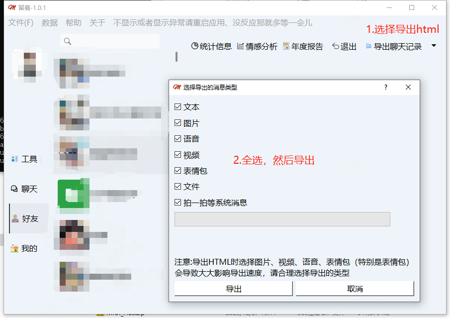
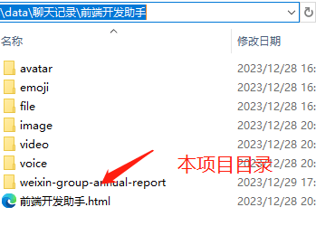
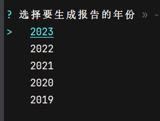
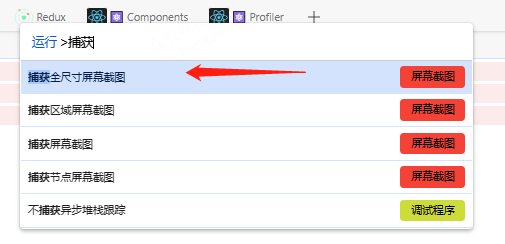

# 微信群年度聊天报告生成


## 🥤效果

<details>

</details>

# ⌛使用
1. 请先使用留痕[WeChatMsg](https://github.com/LC044/WeChatMsg)导出群聊html格式的聊天记录
   
2. git clone或者下载本项目到WeChatMsg生成的群组聊天记录文件夹下面，如下图

   
3. 确保电脑有nodejs运行环境，在`weixin-group-annual-report`目录下执行命令安装依赖
    ```shell
    # xxx/weixin-group-annual-report>
    npm install
    ```
4. ！！！安装依赖完成会提示选择生成报告的年份，一定要选

    

5. 执行下面命令，会自动在浏览器打开
    ```shell
    npm run dev
    ```
6. 浏览器长截图技巧：打开开发者工具，选择手机模式，按ctrl_shift+p,搜索`捕获`或者`full`，点击就会下载屏幕长截图
   

7. 可以运行npm run build,打包网页发布

