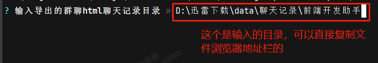

# 微信群年度/月度/周聊天报告生成
<!-- TOC -->
* [微信群年度/月度/周聊天报告生成](#微信群年度月度周聊天报告生成)
  * [🥤效果](#效果)
  * [⌛使用](#使用)
<!-- TOC -->


## 🥤效果


## ⌛使用
1. 请先使用留痕[WeChatMsg](https://github.com/LC044/WeChatMsg)导出群聊html格式的聊天记录
   
2. git clone或者下载本项目
3. 确保电脑有nodejs运行环境，在`weixin-group-annual-report`目录下执行命令安装依赖
    ```shell
    # xxx/weixin-group-annual-report>
    npm install
    ```
4. 安装依赖完成提示选择生成的群聊记录文件夹，输入WeChatMsg生成的群组聊天记录文件夹(如果项目本来就在文件夹下面，会自动跳过本步骤)，
   
5. 然后提示选择生成报告的时间段，一定要选,也可以再次手动执行 `npm run prepare`重新选择目录和时间段
    
6. 执行下面命令，会自动在浏览器打开
    ```shell
    npm run dev
    ```
7. 浏览器长截图技巧：打开开发者工具，选择手机模式，按ctrl_shift+p,搜索`捕获`或者`full`，点击就会下载屏幕长截图
   
8. 可以运行npm run build,打包网页发布

